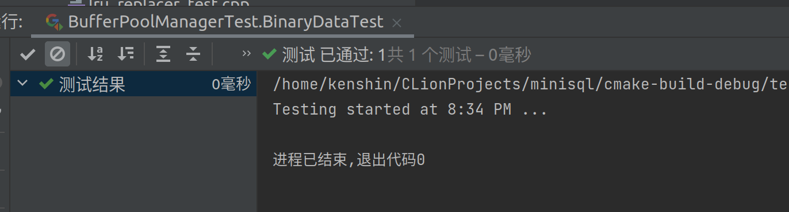

# Report on MiniSQL Lab1

Author: 程政淋 

Student ID: 3200105708

## Lab1 Overview

实验1主要包括了四个部分，分别是：
- 位图的实现
- 磁盘管理的实现
- 缓冲池替换策略的实现
  - LRU 替换策略
  - Clock 替换策略
- 缓冲池的实现

## Bitmap 的实现
每一个位图页由两部分组成，第一部分是元信息，包含已分配的页 `page_allocated` 和下一个空闲页 `next_free_page_`，第二部分是一串 bit 来标记页的分配与否，1代表分配，0代表不分配。实现上采用 `std::bitset<>` 来管理数据页。测试样例结果如下：

### 📌 Notice

此处本来打算更新元信息 `next_free_page_` ，这样在后续磁盘管理从位图中分配数据页时不用逐个查找空闲页( $O(n)$ )，而是可以直接返回空闲页。我计划找到一串 bit 中的第一个0，算法如下：

把一串 bit 记作 data，这里以1110 1011为例：

1. ~data: 0001 0100，取反后问题转化为找到第一个1
2. data - 1: 0001 0011
3. ~(data - 1): 1110 1100
4. (data - 1)&(~(data - 1)): 0001 0000

然后可以将其以整数形式取对数得到是第五个位置上出现 0 ，但我们的问题中的 bit 流有4032位，不可能直接转化为整数，并且 `std::bitset` 并没有相应的无符号加法和减法，因此这个方法也就作罢。

## 磁盘数据页管理

这一部分首先要明白我们的做法是对于整个磁盘，我们有一个 `PAGE_SIZE` 大小的元信息页来管理磁盘数据信息，包含了已分配的位图页和已分配的页的数量，大小为两个 `uint_32t` ，剩下的空间用来记录每一个位图页已分配的页的数量，其次是前面的位图页用于管理一段连续的数据页，依次类推。

从测试代码中我发现了 `DiskFileMetaPage` 这个专门用于管理磁盘元信息的类，于是在从磁盘中分配一页时，我的做法是：

1. 首先从 `extent_nums` 中获得第一个没有分配满的位图页。
   - 如果没有找到而且当前位图页数量已经达到最大可分配数量，返回 `INVALID_PAGE_ID`。
   - 如果没有找到但位图页小于最大数量，分配新的一页，更新分区数量和已分配页数量等元信息，然后调用 `WritePhysicalPage` 写回磁盘并返回分配的页号。
2. 找到没有分配满的位图页，找到该位图页中第一个空闲页并分配，更新元信息，调用 `WritePhysicalPage` 写回磁盘并返回分配的页号（这里就是线性查找可以优化的地方，但是失败了）。

在释放一页时，做法则基本相反：

找到 `logical_page_id` 所在的分区，调用 `ReadPhysicalPage` 读取当前分区的数据，更新元数据，释放对应数据页，再调用 `WritePhysicalPage` 写回磁盘。

测试结果如下：

## 缓冲区替换策略

### LRU 替换策略

LRU 替换策略是最近最少访问者被替换，我的实现方式是用一个链表记录 `frame_id` ，用哈希表记录 `frame_id` 在链表中的位置。效果类似于一个队列，每次 `Unpin` 时，从链表末尾加入，每次寻找 Victim 时，则从链表头取出。

测试结果如下：

### **Bonus: Clock 替换策略**

Clock 替换策略是一种较为开销较低的替换策略，通过给予每个数据页“第二次机会”来实现页面的替换。对每个数据页来说，一共设置两种状态，`ACCESSED` 和 `UNUSED` ，对于初次加入 Clock Replacer 的页面，设置为 `ACCESSED` ，在寻找待替换页面时，先遍历一遍 Replacer ，将 `ACCESSED` 设置为 `UNUSED` ，同时将待替换的页面设置为第一个遇到的 `UNUSED` 页面。 

测试结果如下：

## 缓冲池管理

这个部分集成了前面全部模块，基于代码中注释的提示，以 `FetchPage` 为例，我的做法是：

1. 在 `page_table_` 中搜寻页号。
2. 若存在则直接返回。
3. 若不存在则先从 `free_list_` 中查找，在 `free_list_` 中仍不存在的（缓冲池已满）再使用 LRU 策略进行替换，若没有找到可替换对象，返回空值。
4. 从 `page_table_` 中删除待替换帧（步骤3中找到的），插入新的帧，调用 `ReadPage` 返回该帧的数据信息。

注意该模块的 `FlushPage` 函数的作用是将数据进行磁盘中的回写来删除其 `IsDirty` 标志。

总的来说，该模块的主要工作是实现缓冲池的I/O操作。

测试结果如下：

