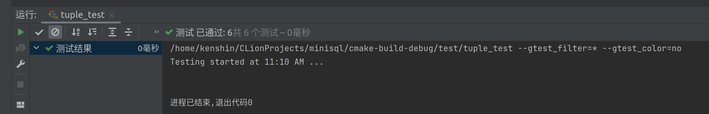
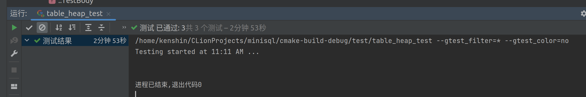

# Report on MiniSQL Lab2

Author: 程政淋 

Student ID: 3200105708

## Lab2 Overview

实验2负责记录的管理，这里的记录也即我们常说的表，分为：

- 行（Row）：也即元组。
- 列（Column）：定义和表示表中的一个字段。
- 模式（Schema）：表示数据表或者是索引的结构，由一个或多个的Column构成。
- 域（Field）：一条记录中某一字段的数据信息，如数据类型，是否为空，值等。

## 序列化和反序列化

为了持久化数据，我们需要对 Row，Column，Schema 和 Field 进行序列化处理，以便它能够存到磁盘中。此外引入魔数做为简单的检验数据正确性的手段。

序列化也即在上游像“水流”一样将数据按字节存到一块连续的内存区域（buffer）中，反序列化即在“下游”从 buffer 中按顺序取出存的东西再重新构造出相应的对象。

### Column

```C++

class Column {
 private:
  static constexpr uint32_t COLUMN_MAGIC_NUM = 210928;
  std::string name_;
  TypeId type_;
  uint32_t len_{0};
  uint32_t table_ind_{0};
  bool nullable_{false};
  bool unique_{false};
};

```
`Column` 的数据成员如上图所示。除了 `string` 类型的对象，我们都可以使用 `MACH_WRITE_TO(Type, buf, DATA)` 来进行序列化，对于 `string` 类型的对象，首先要写入字符串有多少个字节，再使用 `memcpy` 进行序列化。

反序列化时，使用 `MACH_READ_FROM(Type, buf)` 逐个取出。要注意根据 `type_` 的类型在重新构造 `Column` 对象时传入不同的参数。

### Schema

```C++
class Schema{
private:
  static constexpr uint32_t SCHEMA_MAGIC_NUM = 200715;
  std::vector<Column *> columns_;
};
```

`Schema` 的数据成员如上图所示。对于 `vector` 这种容器，我们的做法是先写入容器的大小，再写入容器内容，此处可以调用 `Column` 的序列化。

反序列化构造 `Schema` 对象即可。

### Row 

```C++
class Row{
 private:
  RowId rid_{};
  std::vector<Field *> fields_;
  MemHeap *heap_{nullptr};

  uint32_t fields_nums{0};
  uint32_t null_nums{0};
};
```

`Row` 需要额外记录空域的数量，因此在这里我添加了一个 `null_nums` 用于记录，在其后写入了空域所在的下标。事实上这可以用空位图来表示，节省空间和时间。

序列化只需要调用 `Field` 提供的序列化即可。反序列化时要构造 `Field` 对象。

## 堆表的实现

堆表的数据结构和教材上的基本一致，由表头、空闲空间和已经插入数据三部分组成。在这部分我们需要完成的函数有：

- `bool InsertTuple(Row &row, Transaction *txn)`
- `bool UpdateTuple(const Row &row, const RowId &rid, Transaction *txn)`
- `void ApplyDelete(const RowId &rid, Transaction *txn)`

### `InsertTuple`

插入元组采用了 First Fit 的策略，取出堆表的第一页尝试插入，如果已经不能插入（满了），那我们从 bufferpool 中取出新的一页，如果不能分配新的页，则插入返回失败，否则尝试插入，如此循环直到成功插入。

### `UpdateTuple`

`UpdateTuple` 需要区分更新失败的类型，而不仅仅是返回成功与失败。但是如果希望对当前框架做最小改动，我们应该修改 `src/storage/table_page.cpp` 中的 `UpdateTuple` 的返回值，然后在本节的 `UpdateTuple` 中通过返回值区分失败原因，执行相应的操作。

于是在 `table_page.cpp` 中，我加入了如下的返回状态：

```C++
class TablePage : public Page {
 public:
  enum class RetState { ILLEGAL_CALL, INSUFFICIENT_TABLE_PAGE,DOUBLE_DELETE,SUCCESS };
};
```

- `ILLEGAL_CALL` 代表非法调用，在传入 `slot_num` 无效返回。
- `INSUFFICIENT_TABLE_PAGE` 代表当前页的空间不足以放下一个元组。
- `DOUBLE_DELETE` 代表待更新元组已被删除。
- `SUCCESS` 代表更新成功。

在本节的 `UpdateTuple` 中，根据返回状态我们进行如下操作：

- `ILLEGAL_CALL` 或 `DOUBLE_DELETE`，返回 `false`
- `INSUFFICIENT_TABLE_PAGE`：删除旧元组，将其插入到新的一页
- `SUCCESS`：标记页为脏，返回 `true`

### `ApplyDelete`

调用 `ApplyDelete`，标记页为脏即可。

## 堆表迭代器

堆表迭代器主要作用是给上层模块（第五部分）提供接口，实现表的遍历。

重载的 `==` `!=` `*` `->` 运算符功能不再赘述，主要叙述前置 `++` 运算符的实现，后置 `++` 拷贝一份原指针再调用前置 `++` 即可。

我们调用 `GetNextTupleRid(args)` 得到下一个元组，如果成功，那么我们移动到下一条记录再返回即可，否则意味着下一个元组不在当前页，我们调用 `GetNextPageId()` 从 bufferpool 中取出下一页并获取第一个元组，移动到这条记录再返回。

### 堆表的 `Begin` 和 `End`

对于 `Begin` 我们尝试取出每一页的第一条记录，如果成功取出，则成功找到堆表的第一条记录，否则循环直到找到，若最后找不到，将返回 `INVAILD_ROWID` 构造的迭代器。

对于 `End`，直接返回 `INVAILD_ROWID` 构造的迭代器。

## 测试结果

### `tuple_test.cpp`

由于测试文件缺失，我自己写了 `Column` 和 `Field` 的测试。整体测试结果如下：



### `table_heap_test.cpp`

这里测试插入时只测试了1000行，我测试时很快，不到1s就插入完成了。于是我先将 `row_nums` 改成100000，发现此时插入到69000左右时会插入失败，进行debug后发现是 bufferpool 已经满了且数据页全部被 Pin，无法再分配新的数据页，说明这种插入失败的情况是正常的。如果想要一次性插入很大量的数据时，需要调整位于 `src\common\config.h` 中定义的 `DEFAULT_BUFFER_POOL_SIZE` 。默认是1024，改为4096后我设置 `row_nums` 为200000进行测试，结果如下：



使用 perf 工具进行查看性能热点发现 `InsertTuple` 占据了进程98%以上的资源，符合预期。


